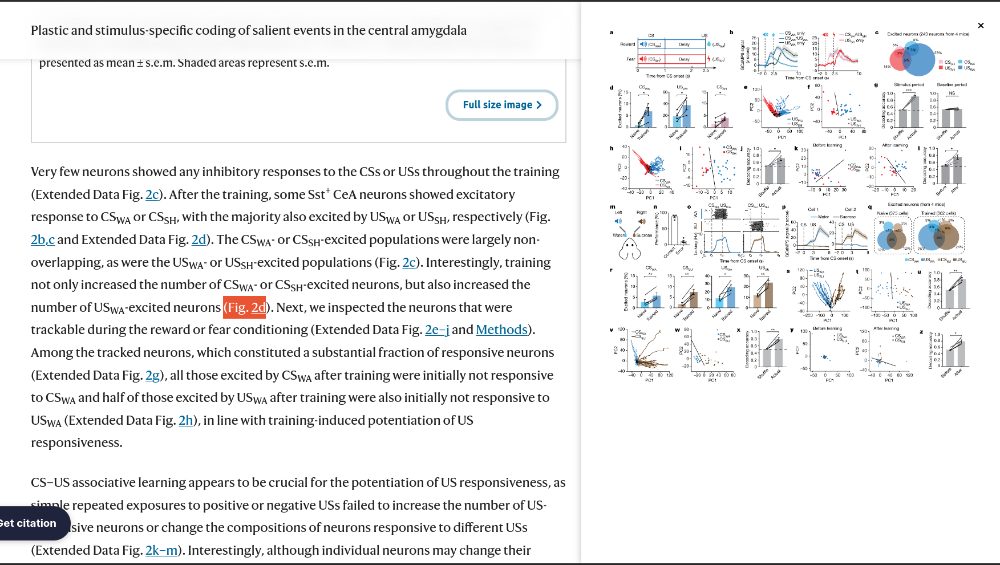
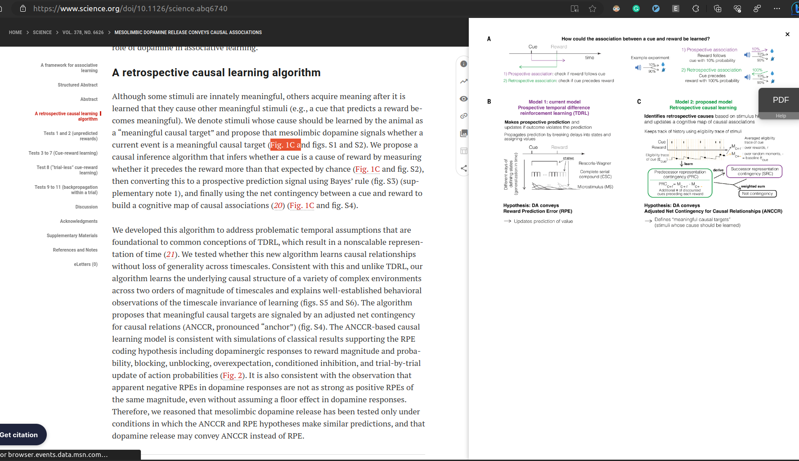
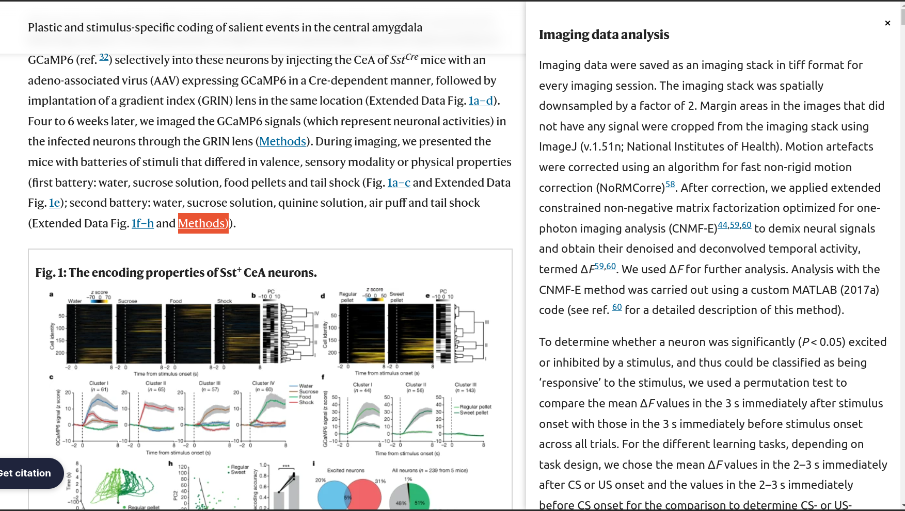
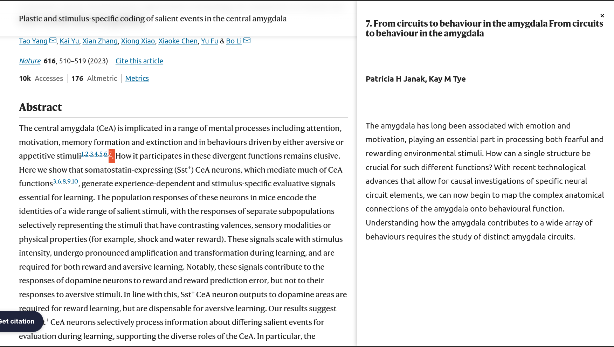
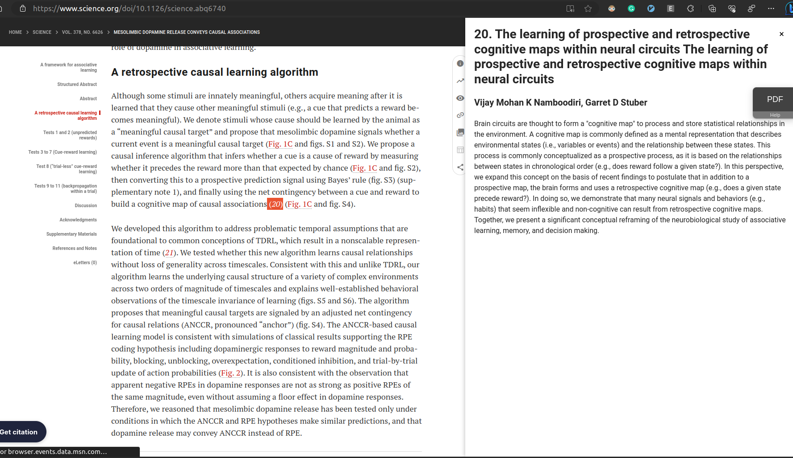

# Easy paper reader extension
While reading neuroscience papers, I often swtich between multiple tabs - one tab for figures, one for methods, one for references, one for actually reading the text. This extension is an attempt towards solving this small load. 

## While reading paper, 
1. Highlight the figure number to see the figure

2. Highlight methods word to see Methods 

3. Highlight reference number to see paper - title, authors abstract

## Journals
1. Nature: Figures, Methods, References
2. Science: Figures, References 